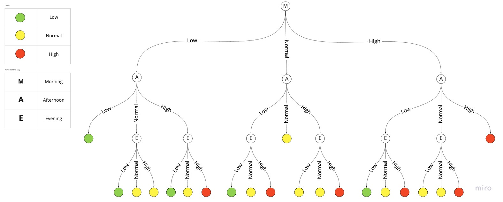

# Build Status


# Introduction
This repo describe a problem with a golang implementation as a possible solution. Using a Decision Tree data structure.

## Challenge Carachteristics

The endpoint [http://localhost:8080/results](http://localhost:8080/results) will give you back a random result with a "customer list" with **sugar** test results.

this is the json structure you can wait for all entries:
```json
{
    "id": "2fa0f3fe-b259-4936-862e-f2aadf784ec9",
    "name": "Henry Casper DDS",
    "email": "Pat.Botsford@yahoo.com",
    "samples": [
      {
        "time": "morning",
        "value": 0.73
      },
      {
        "time": "afternoon",
        "value": 0.46
      },
      {
        "time": "evening",
        "value": 0.12
      }
    ]
  }
```

So, let's read the endpoint and create a result with the number of customers that have the following sugar levels criteria:

* Low - under the reference range
* Normal - in between the reference range
* High - above the reference range

> A person cannot be present in more than one range

Sugar levels normally uses a few samples throughout the day to define the right levels. The sugar reference levels ranges for each period of the day are:

* morning   -> 0.50 - 0.78
* afternoon -> 0.15 - 0.24
* evening   -> 0.12 - 0.21

- If there are two values where the sugar level is the same, then the final result for that user is the respective value. For instance, if two of the samples have `high` values, then the user is categorized as high sugar level.

- If all three sample results are distinct, then the user is categorized as `normal` sugar level.

> Please note that the provided values do not represent real medical values.

The solution output should be like this:

```json
{
    "low": {
        "count": "integer",
        "users": []
    },
    "normal": {
        "count": "integer",
        "users": []
    },
    "high": {
        "count": "integer",
        "users": []
    }
}
```

# Solution

The solution could be implemented in a couple of ways, two came up to my mind:

1. OOP approach: implementing the Design Pattern [Chain of Responsability](https://refactoring.guru/design-patterns/chain-of-responsibility)
2. Use a graph structure like a tree, in this case a [Decision Tree](https://towardsdatascience.com/decision-trees-in-machine-learning-641b9c4e8052)

### 1. Chain of Responsability
CoR could be implemented with a fixed structure with the reference levels of the sugar and then decide to move to the next level until find the latest level and take the final decision.

Since I already implemented this pattern a couple of time, I was curious how would be a graph implementation using a decision tree.

### 2. Decision Tree
A decision tree is constantly seen in Data Science and Machine Learning area of study. In my implementation I have set a Tree Data Structure, not a binary tree, but a tree with 3(three) leafs for each node, which node represent the period of the day (Morning, Afternoon and Evening) and each node also have your reference value.



But why decision tree instead a bunch of ifs aligned. Regarding the problem, in order to mount the result classified with Low, Normal and High, ```Decision Tree``` helps me here to delivery a good runtime complexity and keep the code clean without so many ifs aligned which would be clomplex to maintain in case one of those ifs change.

Since I have a list of customer ```N``` I would need to interate against the amount of customers and push my ```Decision Tree``` in order to classify my customer and then count it. And using a [Breadth-First Search](https://en.wikipedia.org/wiki/Breadth-first_search) approach I would need just 3 steps in my Decision Tree in order to classify my customer as Low, Normal or High. 

> So this way I have a complexity of ``` O(n * 3)``` in a worst case scenario (all classification needs to navigate the whole tree (three levels)), and this is still linear which is good to this problem. 

So, my approach was [to implement each path](decision_tree/decision-tree.go) of the graph in order to navigate until the latest leaf(node) in order to get the result.


## Build and Test

```sh
pushd client && make build && make test && popd 
```

To spin up a mock API server please run the following command:

```sh
pushd backend && make run && make test && popd
```
